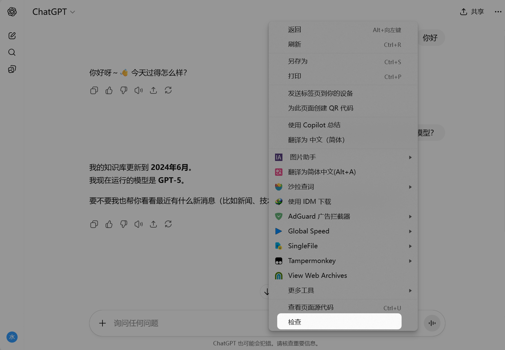
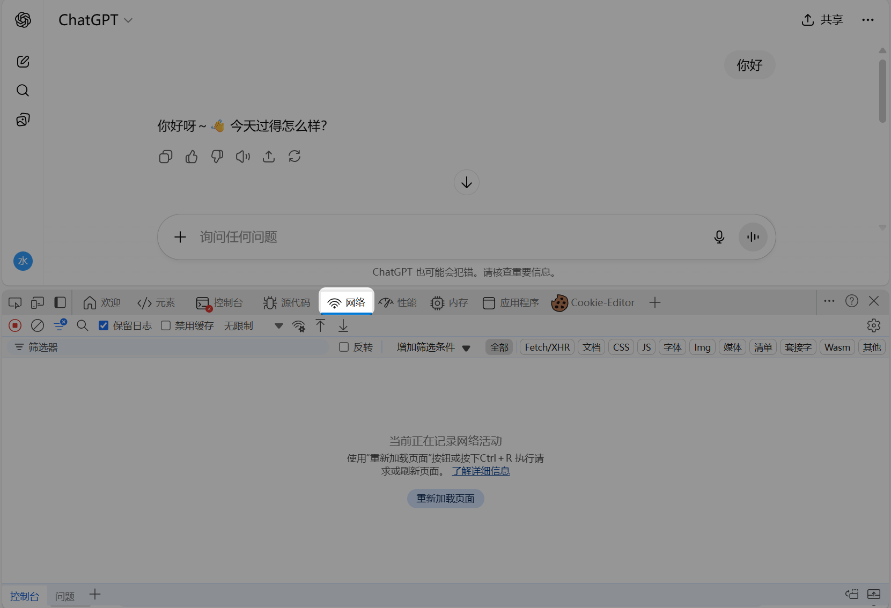
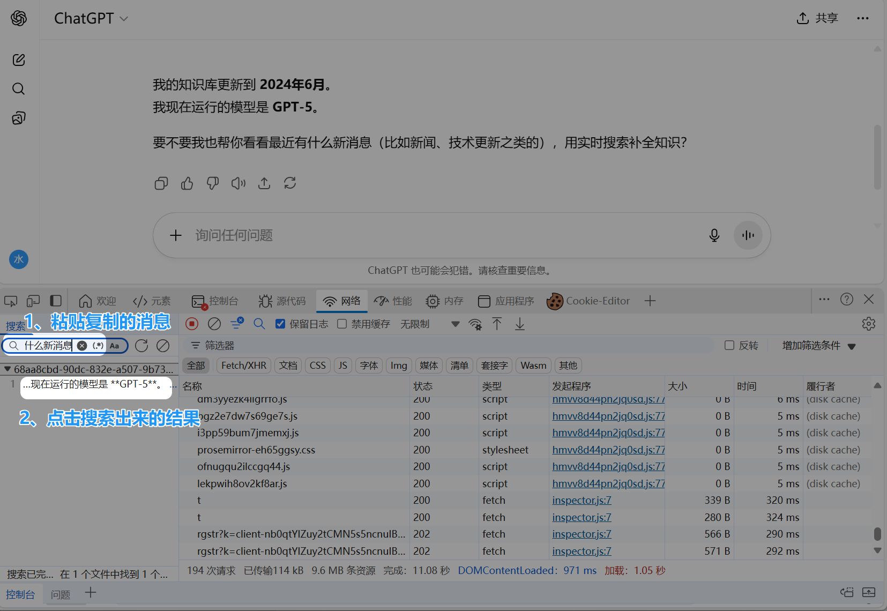
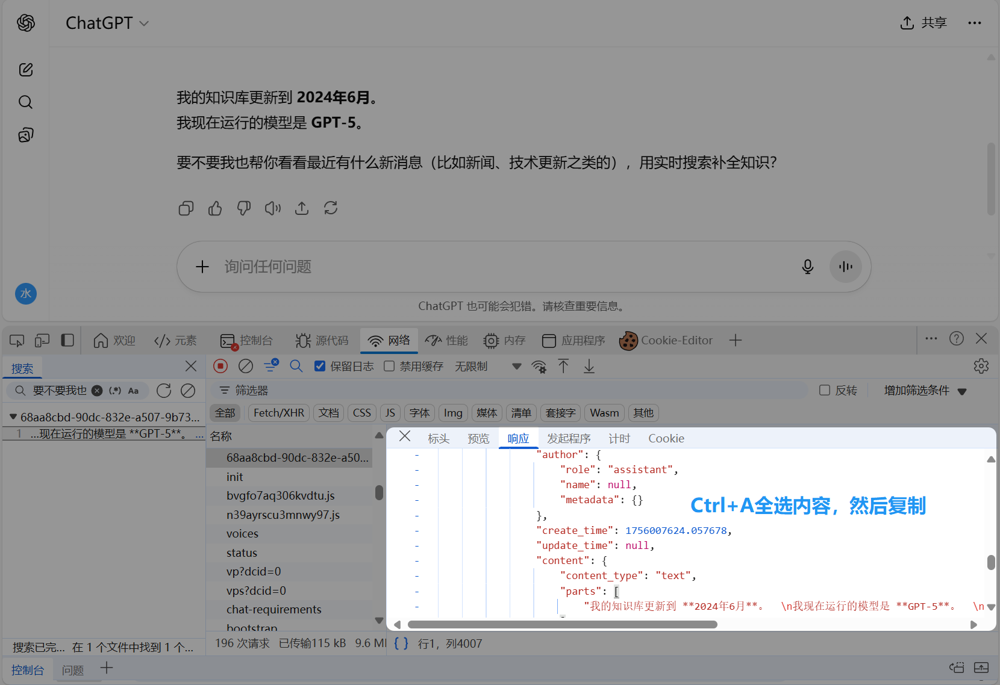
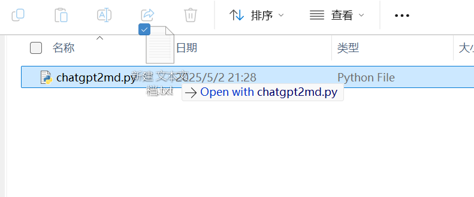
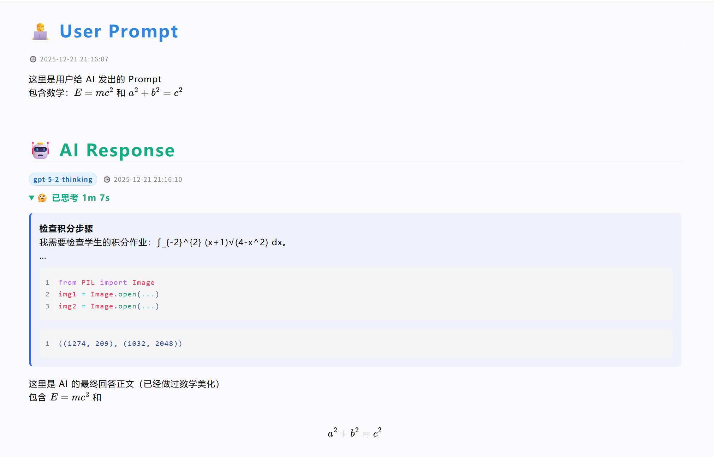

# ChatGPT 聊天记录导出为 Markdown ✨🗂️

将 **ChatGPT 导出 JSON** 转换为可读性很强的 **Markdown**：自动把同一轮推理中出现的 `thoughts` / `assistant code` / `reasoning_recap` 合并为一个可折叠的 `<details>` 区块，并将其插入到“下一条助手文本”的正文最前面；同时支持 **数学公式美化**、**代码推理整段引用渲染**，以及 **图片占位符**（便于后续替换为可访问的远程 URL）🧠🧩🖼️

> 适用于：复盘模型推理、归档对话、技术博客记录、审计与分享。

---

## 特性 ✅

- ✅ **最终态分支**：仅沿 `current_node` 回溯到根，输出“从根到叶”的最终可见对话路径（避免分叉内容混入）🌿
- ✅ **推理合并**：将同一轮的
  - `thoughts`（支持多段，含 `summary` 与 `content`）
  - `assistant code`（自动配对紧随其后的 tool `execution_output`）
  - `reasoning_recap`
  合并为一个 `<details>` 折叠区块，**按时间升序**排列子项 ⏱️
- ✅ **代码推理整段引用**：标题、代码围栏、运行结果围栏全部置于引用（每行以 `>` 开头），阅读体验统一 🧾
- ✅ **数学美化**（跳过代码围栏，包含“引用内代码围栏”）➗
  - 行内 `\( ... \)` → `$ ... $`
  - 显示 `\[` … `\]` → `$$` 块（列表项中整体缩进两格）
- ✅ **推理块与正文之间自动空一行**，排版更稳更清晰 🧱
- ✅ **图片占位符**：遇到聊天里的图片（`multimodal_text` 的 `image_asset_pointer`），输出一个占位符与元信息注释，便于后处理替换为远程 URL 🖼️➡️🌐
- ✅ **纯标准库**，零依赖 🐍
- ✅ **CLI + 交互式输入**：既可 `chatgpt2md input.json`，也可直接运行后手动输入路径 💻
- ✅ **路径容错**：自动处理带空格与带引号的路径，支持 `~` 与环境变量展开 🧭

---

## 安装与环境 🧰

- Python **3.8+**（建议 3.10+）
- 无三方依赖，clone 本仓库即可使用：

```bash
git clone <your-repo-url>
cd <repo>
python chatgpt2md.py -h
```

---

## 使用方法 🚀

### 交互式（无命令行参数）🧑‍💻

```bash
python chatgpt2md.py
```

程序会提示你输入 ChatGPT 导出 JSON 的路径（可带引号）。输出会写到 **同目录**、**同名** 的 `.md` 文件。

### 最简命令行 🏃

```bash
python chatgpt2md.py path/to/conversation.json
# 输出：path/to/conversation.md
```

> 提示：输入文件扩展名不必一定是 `.json`，只要文件内容是 JSON，`.txt` 也可以。

### 指定输入与输出路径 🎯

* 位置参数：

```bash
python chatgpt2md.py path/to/input.json path/to/output.md
```

* 或使用选项：

```bash
python chatgpt2md.py -i path/to/input.json -o path/to/output.md
```

### 命令行帮助 🆘

```bash
python chatgpt2md.py -h
```

### 路径带空格/引号 🧷

以下写法均可（Windows / macOS / Linux）：

```bash
python chatgpt2md.py "C:\path with space\input.json"
python chatgpt2md.py -i "~/Downloads/input.txt" -o "%USERPROFILE%/Desktop/output.md"
```

程序会自动去掉首尾引号，并展开 `~` 与环境变量。

### 拖拽打开（Windows）🪟

你也可以把包含 JSON 的 `TXT` 文件 **拖动到本程序**（`chatgpt2md.py`）图标上打开。程序会把该拖入的文件路径作为输入，并在同目录下生成 `.md`。

---

## 输入文件来源 📥

建议直接从 ChatGPT 网页端抓取 **包含完整对话树的 JSON**（见下文步骤），或使用其他导出工具得到等价结构（需包含 `mapping`、`current_node`、`message` 等字段）。

### 如何获取 JSON 文件（操作步骤）🧭

1. 在 ChatGPT 对话页面右键，点击 **检查** / **开发人员选项**，或直接按 **F12**。
   
2. 在打开的开发者工具中选择 **网络（Network）** 标签。
   
3. 复制聊天中自己发送或 AI 回复的一小段内容（用于后续搜索定位）。
   
4. 刷新网页（Ctrl+R），注意刷新时 **开发者工具不要关闭**。
5. 网络请求列表会出现大量请求。点击一下开发者工具空白处（或任意请求）让焦点回到开发者工具。
6. 按 **Ctrl+F**，粘贴刚刚复制的内容并按 Enter 搜索，点击搜索命中的请求条目（若有多个，请选择与聊天记录相关的那个）。
   
7. 在响应（Response）或预览（Preview）的 JSON 区域，按 **Ctrl+A** 全选并复制。
   
8. 在本地新建一个文本文件（TXT），粘贴保存。建议使用自定义文件名，避免覆盖重要文件。
9. 把该 TXT 拖动到程序上打开，或使用命令行：

   ```bash
   python chatgpt2md.py path/to/conversation.txt
   ```

   文件扩展名不需要改为 `.json`。
   
10. 运行后会在输入文件同目录生成同名 `.md` 文件（若同名已存在会覆盖，建议提前备份）。

---

## 输出示例 🧾



````markdown
<h1 style="color: #2e86de;">🧑‍💻 User Prompt</h1>
<div style="display: flex; gap: 10px; align-items: center; margin-bottom: 10px;">
    <div style="color: #888; font-size: 12px; font-family: sans-serif;">
        🕒 2025-12-21 21:16:07
    </div>
</div>
  
这里是用户给 AI 发出的 Prompt
包含数学：\(E=mc^2\) 和 \[ a^2 + b^2 = c^2 \]
  
  

<h1 style="color: #10ac84;">🤖 AI Response</h1>
<div style="display: flex; gap: 10px; align-items: center; margin-bottom: 10px;">
    <div style="background-color: #e3f2fd; color: #1565c0; padding: 2px 8px; border-radius: 12px; font-size: 12px; font-family: sans-serif; font-weight: bold; border: 1px solid #bbdefb;">
        gpt-5-2-thinking
    </div>
    <div style="color: #888; font-size: 12px; font-family: sans-serif;">
        🕒 2025-12-21 21:16:10
    </div>
</div>
<details>
<summary style="font-weight: bold; color: #10ac84; cursor: pointer;">🤔 已思考 1m 7s</summary>

> **检查积分步骤**
> 我需要检查学生的积分作业：∫_{-2}^{2} (x+1)√(4-x^2) dx。
> …
>
> ```python
> from PIL import Image
> img1 = Image.open(...)
> img2 = Image.open(...)
> ```
> ```
> ((1274, 209), (1032, 2048))
> ```

</details>
  
这里是 AI 的最终回答正文（已经做过数学美化）
包含 $E=mc^2$ 和
$$
a^2 + b^2 = c^2
$$
````

---

## 渲染与规则 🧩

### 推理折叠块 🧠

* 子项按 **(时间, 进入序)** 升序：

  * `thought`：输出

    * `> **summary**`
    * `content` 逐行引用，并进行数学美化（跳过代码围栏）
  * `code`：输出

    * `> **标题**`（若无则使用“代码推理”）
    * 代码围栏与运行结果围栏统一放在同一个引用块中
* 若遍历结束仍有未输出的会话，将其作为 **单独一条助手消息** 输出（仅 `<details>`）。

### 数学美化 ➗

* 行内：`\( ... \)` → `$ ... $`
* 显示：独立行 `\[` … `\]` → `$$` 块，并在列表项中整体缩进两格，前后各空一行
* **跳过代码围栏**（包括引用内的围栏 `> ```python`），避免误替换
* 保留 `\~` 与 `\@`（不做反转义）

### 代码推理整段引用 🧾

* 代码推理段会整体转为 blockquote（每行 `>`），保证标题、代码围栏、运行结果围栏排版一致
* 数学美化阶段会识别 `> ```...` 这种引用内围栏，从而跳过代码内容

### 图片占位符 🖼️

当对话包含图片（`multimodal_text.parts` 内的 `image_asset_pointer`）时，会在正文中插入类似下面的占位符：

```markdown
🖼️ Image 1: cfb45ca6-3bd9-452b-8724-9700f98b954a.png
<!--CHATGPT_IMG kind="attachment" id="file_000000003a1c720c96ca3d1704128ded" name="cfb45ca6-3bd9-452b-8724-9700f98b954a.png" w="1032" h="2048" src="sediment://file_000000003a1c720c96ca3d1704128ded"-->
```

说明：

* 第一行是可读提示，告诉读者这里原本有一张图
* 第二行是 HTML 注释，携带元信息（id/name/尺寸/source），便于后续脚本把它替换为真实远程 URL，例如：

  ```markdown
  
  ```
